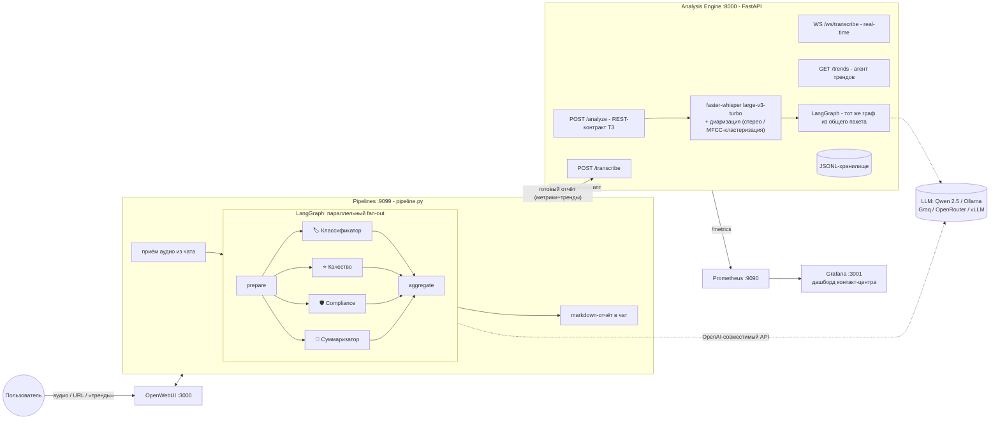

# МТБанк - AI-анализ звонков контакт-центра

[](https://github.com/devAsmodeus/mtbank-ai-hiring/actions/workflows/ci.yml)

[](LICENSE)

Транскрибация звонков (ASR и диаризация) и мультиагентная аналитика на базе
**OpenWebUI Pipelines** и **LangGraph**. Сделано как тестовое задание AI Engineer.

Пользователь прикладывает запись звонка в чат OpenWebUI (или дёргает REST API) и
получает: транскрипт с ролями «Оператор/Клиент», тематику и приоритет обращения,
чеклист качества работы оператора, compliance-проверку, резюме и action items.

---

## Содержание

- [Архитектура](#архитектура)
- [Быстрый старт](#быстрый-старт)
- [Как пользоваться](#как-пользоваться)
- [Архитектурные решения и обоснования](#архитектурные-решения-и-обоснования)
- [Качество ASR: WER-таблица](#качество-asr-wer-таблица)
- [Тесты](#тесты)
- [Мониторинг (Grafana)](#мониторинг-grafana)
- [Бонусные задания](#бонусные-задания)
- [Соответствие ТЗ](#соответствие-тз)
- [Ограничения и продакшен-roadmap](#ограничения-и-продакшен-roadmap)

---

## Архитектура



**Два рантайма - одно ядро.** Пакет `mtbank_analyzer` (агенты, LangGraph-граф,
схемы, логирование) установлен и в контейнер `pipelines`, и в контейнер `api`:

- **OpenWebUI Pipeline** (`pipeline.py`) - интерфейс чата: принимает аудио,
  делегирует тяжёлый ASR движку, **запускает мультиагентный граф у себя**
  (как в скелете из ТЗ), стримит прогресс и рендерит отчёт;
- **Analysis Engine** (`FastAPI`) - REST-контракт ТЗ (`POST /analyze`), ASR
  как сервис, WebSocket real-time, метрики, хранилище и агент трендов.

Логика не дублируется: оба рантайма импортируют один `CallAnalysisOrchestrator`.

## Быстрый старт

Требования: Docker + Docker Compose, ~6 ГБ свободной RAM (whisper + сервисы),
для локальной LLM - ещё ~8 ГБ.

```bash
git clone <ваш-форк> && cd mtbank-ai-hiring
cp .env.example .env          # при необходимости - вписать ключ LLM-провайдера
```

**Вариант A - внешний LLM (рекомендуется для машин без GPU):** впишите в `.env`
данные любого OpenAI-совместимого провайдера (Groq/OpenRouter - бесплатные
tier'ы, примеры прямо в `.env.example`), затем:

```bash
docker compose up -d --build
```

**Вариант B - полностью локально (Ollama):** оставьте `.env` как есть и
поднимите профиль с локальной LLM (модель `qwen2.5:7b` скачается сама):

```bash
docker compose --profile local-llm up -d --build
```

Дальше:

1. Откройте **http://localhost:3000** (OpenWebUI), создайте аккаунт
   (первый пользователь становится администратором).
2. Выберите модель **«МТБанк: Анализ звонка»** в списке моделей.
3. Пришлите ссылку на аудио или прикрепите файл (см. [ниже](#как-пользоваться)).

> ⏳ Первый запуск: контейнер `api` скачивает модель whisper (~1.6 ГБ) в
> named volume - статус виден в `docker compose logs -f api`
> (`whisper_loaded`). Готовность: `curl http://localhost:8000/healthz`.

> 🔑 Чтобы работала загрузка файлов *через чат* (скрепка), выпустите API-ключ в
> OpenWebUI (Settings → Account → API keys) и пропишите его в валве
> `OPENWEBUI_API_KEY` (Admin → Settings → Pipelines) или в `.env` до запуска.
> Анализ по URL работает без этого шага.

| Сервис | Адрес |
|---|---|
| OpenWebUI (чат) | http://localhost:3000 |
| Analysis Engine (REST, OpenAPI-доки) | http://localhost:8000/docs |
| Grafana (дашборд контакт-центра) | http://localhost:3001 (admin/admin, анонимный viewer включён) |
| Prometheus | http://localhost:9090 |

## Как пользоваться

### Чат OpenWebUI

- 📎 прикрепите аудиофайл (WAV / MP3 / OGG) к сообщению;
- 🔗 или пришлите прямую ссылку: `https://.../call.mp3`;
- 📈 или напишите `тренды` - сводка и паттерны по всем проанализированным звонкам.

Pipeline стримит прогресс (транскрибация → агенты) и присылает отчёт:
тематика/приоритет, качество с чеклистом, compliance-таблица нарушений с
цитатами, резюме, action items и полный транскрипт под спойлером.

### REST API

```bash
# файл (multipart)
curl -X POST http://localhost:8000/analyze -F "file=@test_data/dialog_credit_16k.wav"

# по ссылке (JSON)
curl -X POST http://localhost:8000/analyze \
     -H "Content-Type: application/json" \
     -d '{"url": "https://example.com/call.mp3"}'

# только транскрипция с диаризацией
curl -X POST http://localhost:8000/transcribe -F "file=@test_data/monologue_deposit.ogg"

# тренды по накопленным звонкам (бонус)
curl http://localhost:8000/trends
```

Ответ `/analyze` - строго по контракту ТЗ (+ дополнительное поле `meta`):

```json
{
  "transcript": [
    { "speaker": "Оператор", "start": 0.0, "end": 4.2, "text": "Добрый день, МТБанк, меня зовут Анна." }
  ],
  "classification": { "topic": "кредиты", "priority": "medium", "reason": "..." },
  "quality_score": {
    "total": 80,
    "checklist": { "greeting": true, "need_detection": true, "solution_provided": true, "farewell": false },
    "comments": ["Оператор не попрощался"]
  },
  "compliance": { "passed": true, "issues": [] },
  "summary": "Клиент обратился по вопросу кредита наличными...",
  "action_items": ["Оператор: отправить инструкцию на email клиента"],
  "meta": {
    "correlation_id": "…", "audio_duration_sec": 130.0, "language": "ru",
    "asr_model": "large-v3-turbo", "llm_model": "qwen2.5:7b",
    "processing_ms": 41200, "agent_failures": []
  }
}
```

### Real-time транскрибация (WebSocket, бонус)

```bash
python scripts/ws_client.py test_data/dialog_credit_16k.wav
```

Протокол `ws://localhost:8000/ws/transcribe`: клиент шлёт конфиг
`{"sample_rate": 16000}` и бинарные кадры PCM16; сервер каждые ~2 с аудио
возвращает `{"type": "segment", ...}` (латентность ≈ 2 с блок + ~0.5 с
инференс < 3 с), по `{"type": "flush"}` - финальный диаризованный транскрипт.

## Архитектурные решения и обоснования

### Оркестрация: LangGraph, параллельный fan-out, без LLM-супервизора

Все четыре агента читают один транскрипт и не зависят друг от друга - это
**детерминированный DAG**: `prepare → [classifier ∥ quality ∥ compliance ∥
summarizer] → aggregate`. LangGraph выбран за декларативный граф, супершаги с
параллельным исполнением и типизированное состояние с reducer'ами; параллелизм
даёт латентность «максимум по агентам» вместо суммы (~4× быстрее).

LLM-супервизор (Supervisor pattern) здесь не нужен: состав задач фиксирован, и
LLM-роутинг добавил бы латентность, стоимость и недетерминизм, ничего не решая.
Если появятся условные сценарии (например, эскалация «жалобы» на отдельную ветку
агентов), точка расширения готова: `add_conditional_edges` после `prepare`.

### Где живёт что: Pipeline ↔ Engine

- **ASR - сервис** (`/transcribe` в engine): faster-whisper - тяжёлая stateful
  зависимость; модель загружается один раз в одном процессе, контейнер
  pipelines остаётся лёгким (без torch/ctranslate2).
- **Мультиагентный граф - в pipeline** (как в скелете ТЗ): оркестрация
  выполняется внутри OpenWebUI Pipelines; тот же граф из общего пакета
  использует REST `/analyze` - реализация одна, дрейфа между чатом и API нет.
- **Отчёт из чата** отправляется в engine (`POST /reports`), поэтому
  Prometheus-метрики и данные для агента трендов едины для обоих входов.
- Тип pipeline - **Pipe** (отдельная «модель» в OpenWebUI): анализ звонка -
  самостоятельный сценарий со своим выводом; Filter был бы уместен для
  модификации чужих запросов, Action - для кнопок на сообщениях.

### Выбор LLM

Требование - любой OpenAI-совместимый эндпоинт; конфигурация через `.env`
(`LLM_BASE_URL` / `LLM_API_KEY` / `LLM_MODEL`), код от провайдера не зависит.

По умолчанию - **Qwen 2.5 7B Instruct** через Ollama: модель из стека вакансии,
сильный русский язык среди открытых 7B, уверенно держит JSON-схемы, помещается
в 8 ГБ RAM (q4). Для демо без GPU - Groq/OpenRouter (бесплатные tier'ы).
Надёжность структурированного вывода обеспечивается тремя слоями:
JSON-mode (`response_format=json_object`, с автоматическим фолбэком, если
провайдер его не поддерживает) → парсер, срезающий markdown-обёртки →
Pydantic-валидация с одним ретраем, в котором LLM получает текст ошибки.

### ASR: faster-whisper `large-v3-turbo`

ТЗ требует `medium`+. `large-v3-turbo` - дистиллированный large-v3 (4 слоя
декодера вместо 32): **точнее и одновременно в разы быстрее medium**, int8 на
CPU. Замеры на тестовых данных - в [WER-таблице](#качество-asr-wer-таблица)
(средний RTF ≈ 0.3 → файл 5 мин ≈ 90 с на 10-ядерном CPU; на GPU - секунды).
Настройки инференса: `vad_filter=True` (silero VAD),
`condition_on_previous_text=False` (меньше галлюцинационных повторов на
телефонном шуме), `beam_size=2` (компромисс скорость/качество, конфигурируем).

### Диаризация: два пути

1. **Стерео** (автодетект): в колл-центрах PBX обычно пишет оператора и клиента
   в отдельные каналы - каналы транскрибируются раздельно, диаризация точна по
   построению. Определение «настоящего» стерео - сравнением каналов после
   декодирования (апмикс моно даёт идентичные каналы).
2. **Моно**: лёгкая кластеризация - MFCC-статистики каждого ASR-сегмента
   (numpy/scipy, без torch) → иерархическая кластеризация (cosine/average) на
   2 спикеров, с фолбэком в «один говорящий» при вырожденном разбиении.

Роли назначаются по маркерам речи оператора («МТБанк, меня зовут…», «чем могу
помочь») с приором «первым в входящем звонке говорит оператор».

Почему не pyannote: модель gated (нужен HF-токен), она сломала бы
`docker compose up` из коробки. На телефонном моно с двумя говорящими
MFCC-кластеризация закрывает требование «базовой диаризации» из ТЗ.
Продакшен-путь описан в [roadmap](#ограничения-и-продакшен-roadmap).

### Качество: LLM судит - код считает

Агент качества возвращает только булев чеклист и замечания; итоговый балл
считается **кодом** по фиксированным весам (приветствие 20, потребность 25,
решение 35, прощание 20). Оценка воспроизводима, аудируема и не подвержена
«щедрости» LLM. Аналогично в трендах: агрегаты считает код, LLM интерпретирует.

### Compliance: гибрид и fail-closed

Два контура: детерминированные regex-стоп-фразы (запрос CVV/ПИН, «гарантирую
одобрение», манипуляции) + LLM для семантики (отсутствие дисклеймера при
озвучивании ставки, давление, грубость). Результаты объединяются с дедупликацией.
Если LLM-контур упал - **fail-closed**: звонок помечается `passed: false` с
пометкой «требуется ручная проверка» (регуляторная проверка не может молча
«пройти» из-за технической ошибки), при этом regex-контур всё равно выполняется.

### Отказоустойчивость

Падение любого агента не валит анализ: ошибка фиксируется в
`meta.agent_failures`, поле заполняется безопасным фолбэком, отчёт доставляется
(graceful degradation - проверено тестом «LLM полностью недоступна»).
Таймауты на каждом уровне: LLM-клиент (ретраи транспорта), агент
(`asyncio.timeout`), ASR-запрос pipeline. Одновременно выполняется одна
транскрибация (семафор) - на CPU параллельные прогоны только делят ядра.

### JSON-логирование

`structlog` → JSON в stdout во всех сервисах, включая перехват логов uvicorn.
Каждый запуск агента пишет `agent_input` / `agent_output` (полные вход и выход -
требование ТЗ) с `correlation_id`, который сквозной от HTTP-запроса до каждого
агента и возвращается клиенту в `meta.correlation_id` и заголовке `x-request-id`.

### Отступления от рекомендованной структуры

Вместо плоских каталогов `agents/`, `asr/`, `api/` в корне - те же модули внутри
устанавливаемого пакета `src/mtbank_analyzer/` (src-layout). Это то, что делает
возможным «один граф - два рантайма»: пакет ставится в оба контейнера штатным
`pip install`, без sys.path-хаков. `pipeline.py` остаётся в корне, как в ТЗ.

## Качество ASR: WER-таблица

Модель: `large-v3-turbo`, CPU int8 (i7-13620H, 10 ядер), `beam_size=2`, silero VAD.

| Файл | Длит., с | WER | CER | ASR, с | RTF | Реплик (оператор) |
|---|---|---|---|---|---|---|
| `dialog_card_block.mp3` | 94 | **3.6%** | 0.9% | 27.4 | 0.29 | 23 (13) |
| `dialog_card_block_stereo.wav` | 94 | **2.9%** | 0.5% | 22.4 | 0.24 | 25 (14) |
| `dialog_credit_16k.wav` | 130 | **7.9%** | 4.5% | 40.8 | 0.31 | 24 (15) |
| `dialog_credit_8k_phone.wav` | 130 | **8.9%** | 4.8% | 34.4 | 0.26 | 27 (14) |
| `monologue_deposit.ogg` | 47 | **16.9%** | 9.3% | 13.8 | 0.30 | 8 (2) |
| `monologue_transfer_8k.wav` | 24 | **4.4%** | 5.4% | 7.6 | 0.31 | 5 (0) |

Суммарно: 8.7 мин аудио за 146 с (средний RTF 0.28). Телефонный кодек
(8 кГц µ-law) добавляет ~1 п.п. WER к чистой записи (8.9% против 7.9%).
Основной класс «ошибок» - форматирование числительных («10» вместо «десяти»,
«9,5%» вместо «девять и пять десятых процента») и дефисы брендов
(«МТ-банк» против «МТБанк»). Без спец-нормализации они засчитываются как
ошибки, поэтому реальное качество распознавания выше цифр в таблице, что видно
по CER. Пример: `monologue_deposit.ogg`, самый «числовой» текст, даёт 16.9% WER
при полном сохранении смысла.

Отдельно про стерео: раздельная транскрибация каналов потребовала резать
whisper-сегменты по пословным паузам (после VAD whisper склеивает реплики
через длинные окна тишины, ломая порядок при слиянии каналов) - после этого
стерео-файл показывает лучший результат набора (2.9%).

Методика: `python scripts/evaluate_wer.py` прогоняет все файлы `test_data/`
через полный пайплайн (декодирование → whisper → диаризация) и считает WER/CER
(`jiwer`) против эталонов. Нормализация - нижний регистр, `ё→е`, снятие
пунктуации. Числительные к словам не приводятся (модель может написать «10»
вместо «десяти»), поэтому метрики скорее занижены, чем завышены.

Тестовые данные - синтетические диалоги (edge-tts, два голоса), включая
телефонный кодек 8 кГц µ-law, MP3, OGG и двухканальную запись; подробности -
в [test_data/README.md](test_data/README.md).

## Тесты

```bash
pip install -e ".[api,dev]"
pytest -q             # 72 теста
ruff check .          # линт
mypy                  # типизация (src + pipeline.py)
pre-commit install    # git-хук: ruff + ruff format + mypy на каждый коммит
```

| Модуль | Что покрыто |
|---|---|
| `test_agents.py` | Юнит-тест **каждого** агента (fake-LLM): парсинг, ретрай по невалидному JSON, веса качества, regex-контур и дедупликация compliance, обработка ошибок |
| `test_orchestration.py` | Граф целиком: параллельный запуск всех агентов, graceful degradation, fail-closed комплаенса, пустой транскрипт |
| `test_asr.py` | Магические байты форматов, реальное декодирование WAV (PyAV), стерео-детект, MFCC-кластеризация на синтетических «голосах», назначение ролей, сервис с стаб-транскрайбером |
| `test_api.py` | Интеграционно все эндпоинты: `/analyze` (контракт ТЗ, multipart и JSON-URL), ошибки 400/422, `/transcribe`, `/reports`, `/trends`, `/metrics`, `/healthz`, WebSocket real-time |
| `test_pipeline.py` | **Интеграционный тест pipeline**: сообщение → аудио → engine (respx-мок) → LangGraph → markdown-отчёт; файлы OpenWebUI; команда «тренды»; деградация при недоступной LLM |

Тесты не требуют ни GPU, ни загрузки моделей, ни сети - CI проходит за минуты
(`.github/workflows/ci.yml`: ruff + pytest + сборка Docker-образа).

## Мониторинг (Grafana)

`docker compose up` поднимает Prometheus + Grafana с автопровиженным дашбордом
**«МТБанк - Речевая аналитика контакт-центра»** (http://localhost:3001):

- количество проанализированных звонков и средний quality score;
- топ тематик обращений (donut + динамика);
- количество compliance-нарушений;
- p95/p50 длительности этапов (ASR / агенты / всего).

Метрики: `calls_analyzed_total`, `calls_by_topic_total{topic}`,
`call_quality_score` (histogram), `compliance_failed_total`,
`asr_duration_seconds`, `agents_duration_seconds`, `analyze_duration_seconds`,
`analyze_requests_total{status}`.

## Бонусные задания

| Бонус | Статус | Где |
|---|---|---|
| Real-time WebSocket-транскрибация (< 3 с) | ✅ | `WS /ws/transcribe`, демо: `scripts/ws_client.py`, тест в `test_api.py` |
| Grafana-дашборд | ✅ | автопровижен из `deploy/grafana/`, метрики выше |
| Агент трендов | ✅ | `GET /trends` + команда `тренды` в чате; агрегаты считает код, паттерны и рекомендации - LLM |

## Соответствие ТЗ

| Требование | Реализация |
|---|---|
| OpenWebUI Pipeline (обязательно) | `pipeline.py` - Pipe-тип, Valves, on_startup/on_valves_updated, стриминг прогресса |
| ASR: faster-whisper, medium+ | `large-v3-turbo` (точнее и быстрее medium), конфигурируемо |
| Форматы WAV/MP3/OGG (мин. 2) | все три, валидация по магическим байтам |
| Диаризация Оператор/Клиент | стерео-каналы + MFCC-кластеризация моно + ролевые маркеры |
| Транскрипт: speaker + start/end + text | `TranscriptSegment`, контракт 1:1 |
| ≥4 агента через Pipeline | классификатор, качество, compliance, суммаризатор (+ трендовый) |
| Оркестрация LangGraph, обоснование | параллельный fan-out/fan-in, см. [обоснования](#архитектурные-решения-и-обоснования) |
| REST `POST /analyze` (file/url) + JSON-контракт | `api/routes.py`, интеграционные тесты контракта |
| Python 3.11+, FastAPI | да (3.11, Pydantic v2, asyncio) |
| Docker Compose одним запуском | `docker compose up` - весь стек, LLM-профиль опционален |
| pytest: юнит на агента + интеграционный pipeline | 72 теста, см. [Тесты](#тесты) |
| `.env` + `.env.example` | есть, все параметры документированы |
| JSON-логи вход/выход агентов | structlog, `agent_input`/`agent_output` + correlation_id |
| Тестовые данные: ≥5 файлов, 8 кГц, диалог 1+ мин, ≥5 мин | 6 файлов, 8.7 мин, два 8 кГц µ-law, два диалога |
| WER-таблица | выше + `scripts/evaluate_wer.py` |

## Деплой живого демо (HTTPS)

Проверено на VPS 4 vCPU / 8 ГБ RAM (Hetzner CX32 и аналоги) с внешним LLM
(Groq/OpenRouter - бесплатные tier'ы, GPU не нужен):

```bash
# на сервере: docker + compose уже установлены
git clone <ваш-репозиторий> && cd mtbank-ai-hiring
cp .env.example .env && nano .env     # LLM_BASE_URL / LLM_API_KEY / LLM_MODEL
docker compose up -d --build

# HTTPS одним бинарём: caddy как reverse-proxy c автоматическим Let's Encrypt
sudo apt install caddy
```

`/etc/caddy/Caddyfile`:

```
demo.example.com {
    reverse_proxy localhost:3000      # OpenWebUI
}
api.demo.example.com {
    reverse_proxy localhost:8000      # REST /analyze (+ /docs)
}
grafana.demo.example.com {
    reverse_proxy localhost:3001
}
```

Ориентир по латентности `/analyze` на 4 vCPU: файл 5 минут ≈ 40-60 с ASR
(large-v3-turbo int8, RTF ≈ 0.3 - см. WER-таблицу) + 5-15 с агенты
(параллельно, Groq) - укладывается в требование «< 60 с» из ТЗ.

## Ограничения и продакшен-roadmap

Часть решений упрощена там, где продакшен потребовал бы инфраструктуры за
рамками ТЗ:

- **Диаризация** - MFCC-кластеризация слабее нейронных эмбеддингов на
  однополых парах голосов и перебивках. Продакшен: pyannote 3.1 / ECAPA-TDNN
  эмбеддинги + oracle-количество спикеров из телефонии; для русского ASR -
  сравнить GigaAM-v3 (из стека вакансии) с whisper по WER на реальных звонках.
- **Очереди** - сейчас запрос-ответ; под нагрузкой звонки должны идти через
  RabbitMQ/Kafka (батч-транскрибация ночью, real-time поток днём), воркеры ASR
  масштабируются горизонтально.
- **Хранилище** - JSONL достаточно для трендов в демо; продакшен: PostgreSQL
  (отчёты, агрегаты) + MinIO (аудио, транскрипты) + Qdrant для RAG-поиска по
  базе знаний и истории звонков (dense + BM25, как в стеке вакансии).
- **Безопасность** - добавить авторизацию на engine (сейчас он за периметром
  compose-сети, наружу торчит только для демо), маскирование ПДн в логах,
  retention-политики.
- **MLOps** - версионирование промптов и A/B-тестирование (сейчас промпты в
  коде), офлайн-оценка агентов на размеченном наборе, регрессионные прогоны
  WER на каждый релиз, k8s + Helm + ArgoCD вместо compose.
- **OpenWebUI** - загрузка файлов через чат требует API-ключа OpenWebUI
  (валва `OPENWEBUI_API_KEY`); анализ по URL работает без него.

## Структура репозитория

```
├── pipeline.py                  # OpenWebUI Pipeline (вход из чата)
├── src/mtbank_analyzer/         # общее ядро (ставится в оба контейнера)
│   ├── agents/                  # base (LLM, ретраи, логи) + 4 агента + тренды
│   ├── orchestration/graph.py   # LangGraph: fan-out/fan-in, деградация
│   ├── asr/                     # audio (декодирование), transcriber, diarizer, service
│   ├── api/                     # FastAPI: routes, ws (real-time), metrics
│   ├── prompts/                 # версионированные промпты агентов (YAML)
│   ├── rules/                   # compliance-стоп-фразы и веса скоринга (YAML)
│   ├── prompts.py, rules.py     # реестры промптов и правил
│   ├── eval.py                  # оценка качества агентов на golden-set
│   ├── schemas.py               # Pydantic v2 контракт ТЗ
│   ├── config.py                # pydantic-settings (.env)
│   ├── logging_setup.py         # structlog → JSON
│   └── storage.py               # хранилище анализов (Protocol + JSONL)
├── eval/golden_set.yaml         # эталонные звонки для оценки агентов
├── tests/                       # 72 теста (агенты, граф, ASR, API, pipeline, eval)
├── test_data/                   # 6 аудио + эталоны + WER-отчёт (см. README)
├── scripts/                     # generate_test_data, evaluate_wer, evaluate_agents, ws_client
├── deploy/                      # Dockerfile.api, Dockerfile.pipelines, prometheus, grafana
├── docker-compose.yml           # весь стек одной командой
└── .env.example                 # вся конфигурация с комментариями
```
